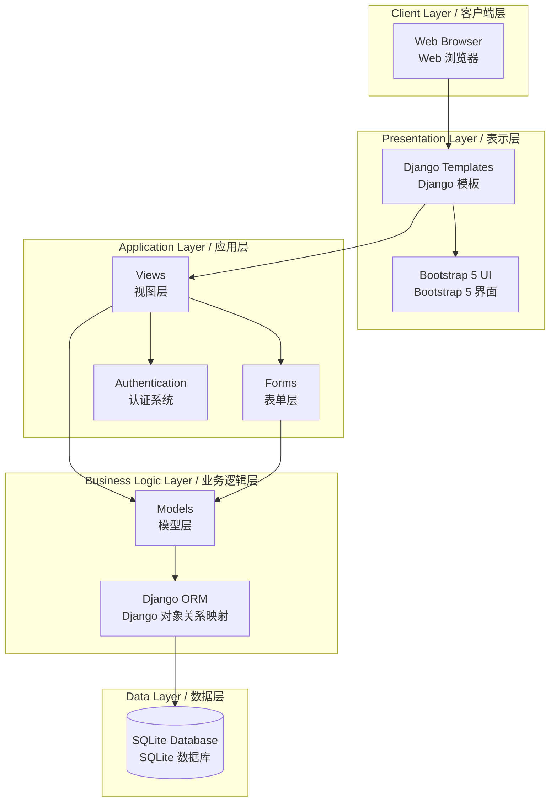
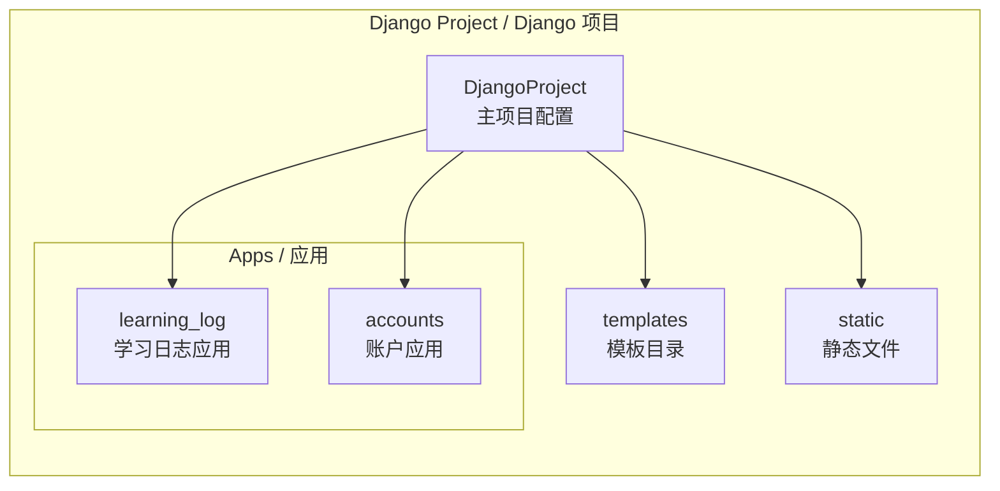
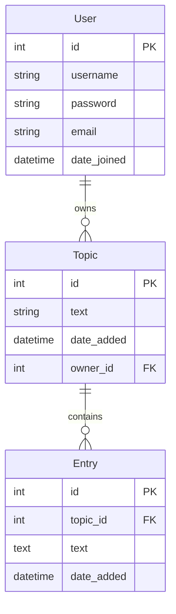
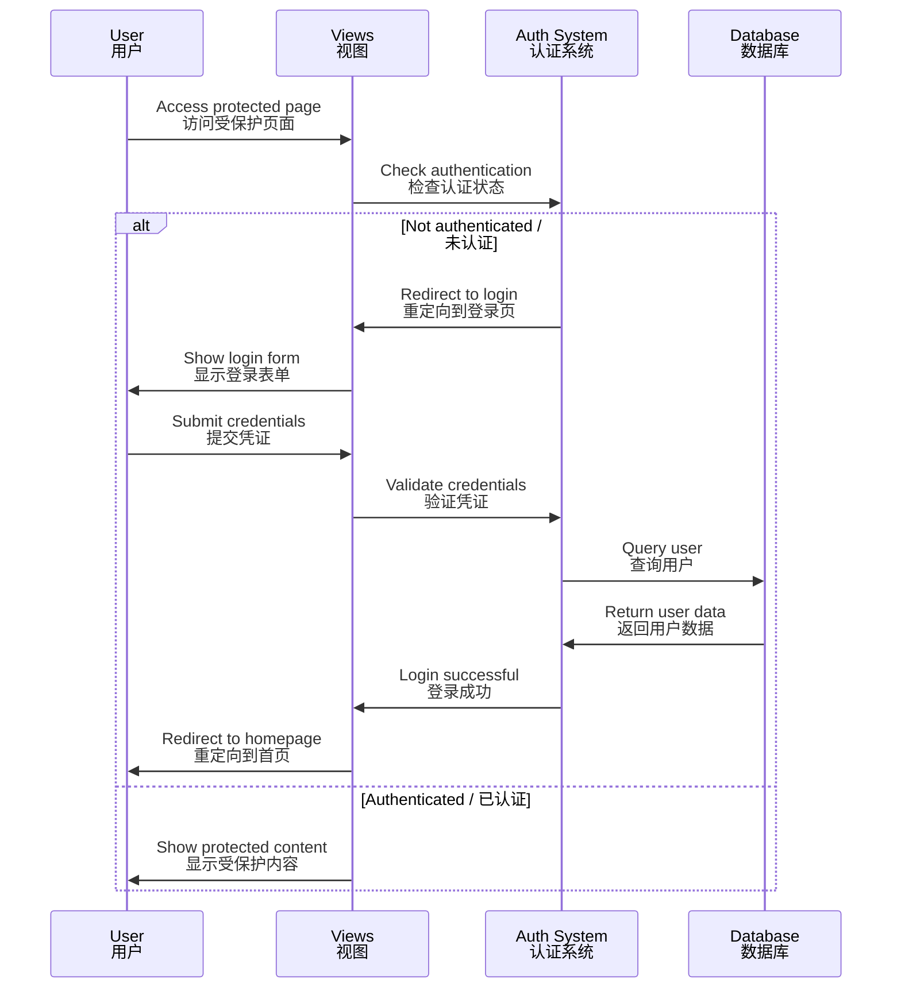
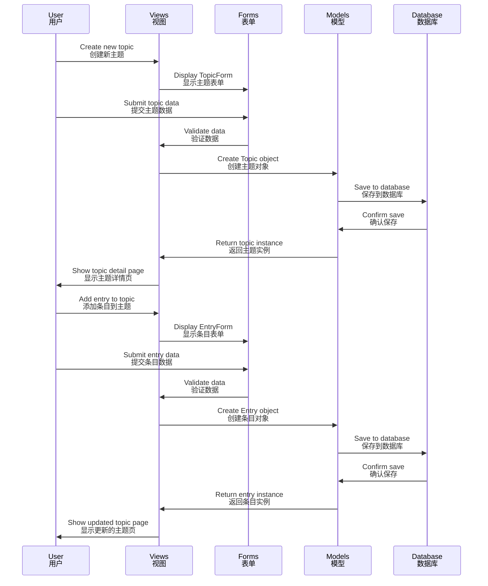

# Learning Log Architecture / 学习日志架构文档

[English](#english) | [中文](#chinese)

<div id="english"></div>

## English

## Project Overview

Learning Log is a Django-based web application that follows the MTV (Model-Template-View) architecture pattern. This document provides a comprehensive overview of the system architecture, data models, and application flow.

## System Architecture

### High-Level Architecture



### Application Structure



## Data Models

### Entity Relationship Diagram



### Model Descriptions

#### User Model (Django Built-in)

- **Purpose**: Manages user authentication and authorization
- **用途**: 管理用户认证和授权
- **Key Fields**: username, password, email
- **关键字段**: 用户名、密码、邮箱

#### Topic Model

- **Purpose**: Represents a learning topic created by a user
- **用途**: 代表用户创建的学习主题
- **Key Fields**:
  - `text`: Topic name (max 200 characters)
  - `date_added`: Timestamp of creation
  - `owner`: Foreign key to User
- **关键字段**:
  - `text`: 主题名称（最多200字符）
  - `date_added`: 创建时间戳
  - `owner`: 用户外键

#### Entry Model

- **Purpose**: Represents a learning entry/note for a specific topic
- **用途**: 代表特定主题的学习条目/笔记
- **Key Fields**:
  - `topic`: Foreign key to Topic
  - `text`: Entry content (unlimited length)
  - `date_added`: Timestamp of creation
- **关键字段**:
  - `topic`: 主题外键
  - `text`: 条目内容（无长度限制）
  - `date_added`: 创建时间戳

## Application Flow

### User Authentication Flow



### Topic and Entry Management Flow



## Directory Structure

```
DjangoProject/
├── DjangoProject/              # Main project configuration / 主项目配置
│   ├── __init__.py            # Python package marker / Python包标记
│   ├── settings.py            # Project settings / 项目设置
│   ├── urls.py                # Main URL dispatcher / 主URL分发器
│   ├── wsgi.py                # WSGI deployment / WSGI部署配置
│   └── asgi.py                # ASGI deployment / ASGI部署配置
│
├── learning_log/               # Learning log application / 学习日志应用
│   ├── __init__.py            # Python package marker / Python包标记
│   ├── admin.py               # Admin interface config / 管理界面配置
│   ├── apps.py                # App configuration / 应用配置
│   ├── models.py              # Data models / 数据模型
│   ├── views.py               # View functions / 视图函数
│   ├── forms.py               # Form classes / 表单类
│   ├── urls.py                # App URL patterns / 应用URL模式
│   ├── tests.py               # Unit tests / 单元测试
│   └── migrations/            # Database migrations / 数据库迁移
│
├── accounts/                   # User authentication app / 用户认证应用
│   ├── __init__.py            # Python package marker / Python包标记
│   ├── views.py               # Auth views / 认证视图
│   ├── urls.py                # Auth URL patterns / 认证URL模式
│   └── migrations/            # Database migrations / 数据库迁移
│
├── templates/                  # HTML templates / HTML模板
│   ├── learning_log/          # Learning log templates / 学习日志模板
│   │   ├── index.html         # Homepage / 首页
│   │   ├── topics.html        # Topics list / 主题列表
│   │   ├── topic.html         # Topic detail / 主题详情
│   │   ├── new_topic.html     # New topic form / 新建主题表单
│   │   ├── new_entry.html     # New entry form / 新建条目表单
│   │   └── edit_entry.html    # Edit entry form / 编辑条目表单
│   └── registration/          # Auth templates / 认证模板
│       ├── login.html         # Login page / 登录页
│       └── register.html      # Registration page / 注册页
│
├── static/                     # Static files / 静态文件
│   ├── css/                   # Stylesheets / 样式表
│   ├── js/                    # JavaScript files / JavaScript文件
│   └── images/                # Images / 图片
│
├── manage.py                   # Django management script / Django管理脚本
├── db.sqlite3                  # SQLite database / SQLite数据库
├── requirements.txt            # Python dependencies / Python依赖
├── .env                        # Environment variables / 环境变量
└── .gitignore                  # Git ignore rules / Git忽略规则
```

## URL Routing

### Main URL Configuration

```
/ (root)
├── admin/                      # Django admin panel / Django管理面板
├── accounts/                   # Authentication URLs / 认证URL
│   ├── login/                 # Login page / 登录页
│   ├── logout/                # Logout / 登出
│   └── register/              # Registration / 注册
└── learning_log/              # Learning log URLs / 学习日志URL
    ├── (empty)                # Homepage / 首页
    ├── topics/                # Topics list / 主题列表
    ├── topics/<id>/           # Topic detail / 主题详情
    ├── new_topic/             # Create topic / 创建主题
    ├── new_entry/<id>/        # Create entry / 创建条目
    └── edit_entry/<id>/       # Edit entry / 编辑条目
```

## Security Features

### Authentication & Authorization

- **Login Required Decorators**: Protect views from unauthorized access
- **登录保护装饰器**: 保护视图免受未授权访问
- **Ownership Verification**: Users can only access their own topics and entries
- **所有权验证**: 用户只能访问自己的主题和条目
- **HTTP 404 on Unauthorized Access**: Returns 404 for unauthorized resource access
- **未授权访问返回404**: 对未授权的资源访问返回404

### Data Protection

- **CSRF Protection**: All forms use CSRF tokens
- **CSRF保护**: 所有表单使用CSRF令牌
- **Password Hashing**: Django's built-in password hashers
- **密码哈希**: Django内置密码哈希器
- **SQL Injection Prevention**: Django ORM protects against SQL injection
- **SQL注入防护**: Django ORM防止SQL注入

## Technology Stack

| Layer / 层次 | Technology / 技术 | Purpose / 用途 |
|-------------|-------------------|---------------|
| Frontend / 前端 | Bootstrap 5 | Responsive UI / 响应式界面 |
| Backend / 后端 | Django 5.2.4 | Web framework / Web框架 |
| Database / 数据库 | SQLite | Data storage / 数据存储 |
| Template Engine / 模板引擎 | Django Templates | Dynamic HTML / 动态HTML |
| Forms / 表单 | Django Forms | Data validation / 数据验证 |
| Authentication / 认证 | Django Auth | User management / 用户管理 |

## Deployment Considerations

### Production Checklist

- [ ] Set `DEBUG = False` in settings.py / 在settings.py中设置`DEBUG = False`
- [ ] Use environment variables for sensitive data / 使用环境变量存储敏感数据
- [ ] Configure `ALLOWED_HOSTS` / 配置`ALLOWED_HOSTS`
- [ ] Use production database (PostgreSQL recommended) / 使用生产数据库（推荐PostgreSQL）
- [ ] Collect static files: `python manage.py collectstatic` / 收集静态文件
- [ ] Set up HTTPS / 设置HTTPS
- [ ] Configure email backend for notifications / 配置邮件后端用于通知

### Recommended Hosting Platforms

- **Heroku**: Easy deployment with PostgreSQL support / 简单部署，支持PostgreSQL
- **PythonAnywhere**: Python-focused hosting / Python专注托管
- **Railway**: Modern deployment platform / 现代部署平台
- **DigitalOcean**: VPS with full control / VPS完全控制
- **AWS Elastic Beanstalk**: Scalable AWS solution / 可扩展的AWS解决方案

---

<div id="chinese"></div>

## 中文

## 项目概述

学习日志是一个基于 Django 的 Web 应用程序，遵循 MTV（模型-模板-视图）架构模式。本文档提供了系统架构、数据模型和应用程序流程的全面概述。

## 核心特性

- 用户认证和授权
- 个人学习主题管理
- 学习条目的创建和编辑
- 基于用户的数据隔离
- 响应式界面设计

## 扩展建议

### 功能增强

1. **搜索功能**: 添加全文搜索
2. **标签系统**: 为主题和条目添加标签
3. **导出功能**: 导出为 PDF 或 Markdown
4. **统计图表**: 学习进度可视化
5. **协作功能**: 主题分享和协作

### 性能优化

1. **数据库索引**: 为常用查询添加索引
2. **缓存**: 使用 Redis 缓存
3. **分页**: 大量数据时的分页显示
4. **异步任务**: 使用 Celery 处理后台任务

---

**Last Updated / 最后更新**: 2025-12-30
